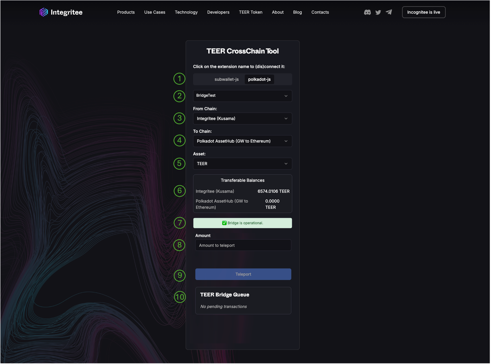
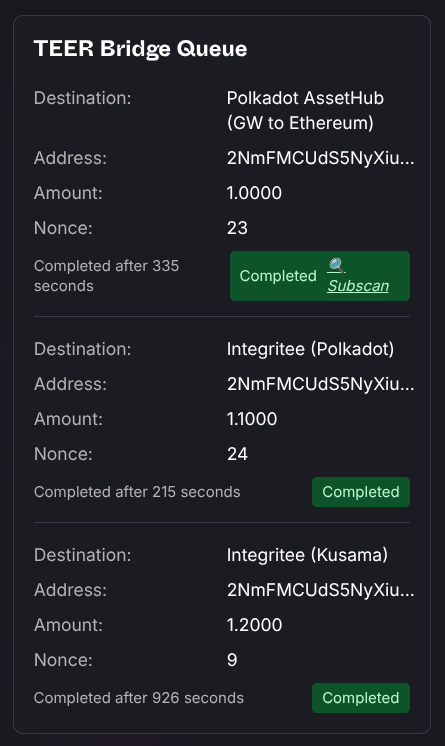
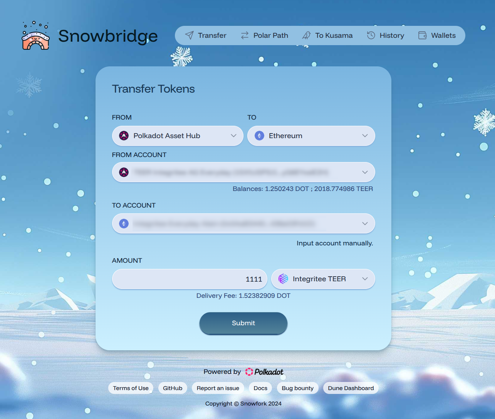

# 2.4.5 How to bridge TEER

The TEER token is available on multiple chains which are connected through [trustless bridges](https://polkadot.com/get-started/bridges/). The following diagram shows an overview of all chains and relevant exchanges:

Most likely, your TEER tokens reside on our Kusama Parachain where we issued them as crowdloan rewards and where centralized exchanges currently withdraw and deposit from.

## Bridging TEER between integritee-kusama and integritee-polkadot Parachains

TEER is the native token of both our parachains, integritee-kusama and integritee-polkadot. TEER can be bridged trustlessly and fungibly between these networks. We have simplified this process with the porTEER pallet

### TEER Crosschain Tool Overview

The [TEER Crosschain Tool](https://crosschain.integritee.network) has different sections to facilitate a transfer.
The graphic below highlights these sections.

1. Wallet extension selection. 
   You can select different wallet extensions like PolkadotJS, Subwallet or others.
2. Account selection. 
   Select the account holding your TEER.
3. Source chain selection. 
   Select the source chain you want to transfer TEER from.  The first time you will use this tool it will likely be “Integritee Kusama”.
4. Target chain selection. 
   Select the target chain you want to transfer TEER to. The first time you will use this tool you likely want to select “Polkadot Assethub”, especially if you'd like to bridge your TEER further to Ethereum using [snowbridge](https://app.snowbridge.network).
5. Asset selection. 
   Select the asset you want to use. Select “TEER”.  
   In the future we might support other assets as well, including TEERdays.
6. Balances overview. 
   You can see your current balances on both the source and target chain.
7. App notifications. 
   This section holds important notifications about the current state of the bridge and other transfer related information.
8. Amount entry field.
9. Transfer button. 
   Allows to finally submit a transaction
10. Bridging queue status. 
    This section holds information about the status of your submitted bridging transactions.

### Bridge TEER from Integritee Kusama to Polkadot Assethub:

1.	Open the [TEER Crosschain Tool](https://crosschain.integritee.network) in the browser or open Subwallet’s (mobile app) *dApp browser* and open `crosschain.integritee.network`.
2.	The “TEER CrossChain Tool” will open. All you need to do is choose the desired extension, for example subwallet-js or polkadot-js. Choose the account you want to transfer TEER from, and click “connect”.
3.	Select the account from the dropdown. “From chain” will say “Integritee (Kusama), and “To Chain” will, by default, present “Polkadot AssetHub (GW to Ethereum)".
4.	You’ll see the available transferable balances on both origin and destination networks. In “amount to teleport”, input the amount you wish to bridge.

### Bridge TEER from back from Polkadot Assethub to Integritee Kusama:

1.	Open the [TEER Crosschain Tool](https://crosschain.integritee.network) in the browser or open Subwallet’s (mobile app) *dApp browser* and open `crosschain.integritee.network`.
2.	The “TEER CrossChain Tool” will open. All you need to do is choose the desired extension, for example subwallet-js or polkadot-js. Choose the account you want to transfer TEER from, and click “connect”.
3.	Select the account from the dropdown. “From chain” will say “Polkadot AssetHub (GW to Ethereum )” and “To Chain” should be “Integritee Polkadot”.
4.	You’ll see the available transferable balances on both origin and destination networks. In “amount to teleport”, input the amount you wish to bridge.
5.	After this you would have to repeat the step 4. with “From chain” “Integritee Polkadot” and “To Chain” should be “Integritee Kusama”.

### Watching Progress

Bridging TEER usually takes between 3-30min. The crosschain tool will keep watching the progress and show you when the funds have arrived at their destination.

Keep your window open if you want to follow the process. If you closed the window you can still check subscan.io for the destination chain.

### ⚠️ Important ⚠️
* By default, the bridge interface is set to transfer TEER to Polkadot AssetHub. This only works if you already have DOT on AssetHub, because TEER is not a [sufficient asset](https://wiki.polkadot.com/learn/learn-accounts/#existential-deposit-and-reaping) on Polkadot Asset Hub. If you don’t have any DOT, the warning *“Your account on the destination chain is not able to exist by only holding TEER. Please transfer some DOT first”* will appear.

* To get your TEER back to Integritee Kusama, the route you should follow is:
Polkadot AssetHub ➡️ Integritee (Polkadot) ➡️ Integritee (Kusama)

* If you want to use centralized exchanges, do not transfer your TEER from Integritee Kusama to Polkadot for now, as you won’t be able to send them to centralized exchanges from there. Having TEER on Polkadot will be useful to use different dApps and access other ecosystems like [Uniswap on Ethereum](https://app.uniswap.org/explore/tokens/ethereum/0x769916A66fDAC0E3D57363129caac59386ea622B?inputCurrency=NATIVE), but transferring and receiving TEER via centralized exchanges is an operation done on our Kusama parachain for the time being.

Also note:
* bridging costs fees in TEER which will be charged on the source chain on top of the amount you choose to be bridged.
* If your destination is the Asset Hub, an additional tiny fee will be charged in TEER subtracted from the amount bridged.
* The Integritee team simulates the process every 30 seconds and monitors the bridges. However, we cannot guarantee that the bridge will always be available because it relies on external components like the asset hubs, bridge hubs and relayers which may change their fees and behavior over time and are out of our control. Moreover, we rely on asset swaps along the way and volatility in asset conversion can temporarily pause the bridge. Our monitoring ensures that the bridge will be swiftly paused in case of any issues until we can resolve them.

## Bridging TEER between integritee-polkadot and Ethereum

TEER also exists as an [ERC-20 token on Ethereum](https://etherscan.io/token/0x769916a66fdac0e3d57363129caac59386ea622b). [Snowbridge](https://app.snowbridge.network/) is your go-to dApp to bridge TEER between Ethereum and asset-hub-polkadot. Once on Ethereum, you may want to use your TEER on [Uniswap](https://app.uniswap.org/explore/tokens/ethereum/0x769916A66fDAC0E3D57363129caac59386ea622B?inputCurrency=NATIVE) or other DeFi applications.

### Usage

Assuming you already have TEER on AssetHub Polkadot and want to bridge them to Ethereum:
1. visit [Snowbridge dApp](https://app.snowbridge.network/)
2. from "Polkadot Asset Hub"
3. to "Ethereum"
4. from account: connect your Polkadot wallet holding TEER on Polkadot Asset Hub
5. to account: connect your Ethereum wallet which shall receive the bridged TEER
6. amount: enter the amount of TEER you want to bridge
7. select "Integritee TEER" as asset
8. click "Submit" and follow the instructions

Of course, you can also bring TEER back from Ethereum to Polkadot Asset Hub via Snowbridge.

