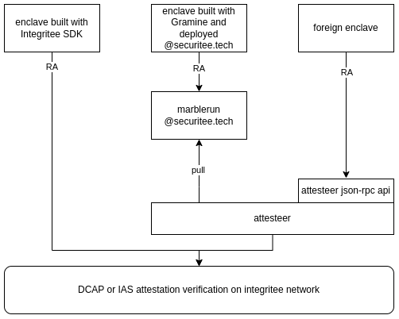

# 4.5 Attesteer

The Integritee Attesteer is an API service to interface with the decentralized DCAP attestation on the Integritee Network.


**Advantages of using the attesteer:**

* No need for a license with Intel
* Your end-users can themselves verify remote attestation and authenticate your enclave (client side) thanks to our public integritee network.
* Unstoppable: remote attestation on Integritee Network does not rely on the consent or availability of Intel or data centers hosting your SGX machine.
* Hassle-free remote attestation

## Three Ways to do Remote Attestation on Integritee Network

1. If you build your enclave based on our SDK you don't need the attesteer because your enclave will be sovereign - it can interact with the Integritee Network to do DCAP attestation independently.
2. If you build your enclave with [Gramine](https://gramineproject.io/) and deploy it with [securitee.tech](http://securitee.tech), You need not to worry, attestation on Integritee Network will happen automatically, managed by [marblerun](https://www.edgeless.systems/products/marblerun/) operated by Securitee.
3. Should you build a custom enclave yourself from scratch, the attesteer json-rpc is your easy to use gateway API to the Integritee Network. See instructions below on how to do that.



## How to use the Attesteer

The Attesteer acts as a proxy for remote attestion for enclaves which are not sovereign (can't send RA transaction to the Integritee Network by themselves). For Intel SGX enclaves, this is really just a proxy forwarding which would not even need to run in an enclave.

### Submitting your Attestation Quote

For enclaves not built with our SDK and not managed by marblerun on [securitee.tech](http://securitee.tech), the Attesteer exposes a json-rpc api which can be used to forward attestation quotes. Here we will show how this works with Intel's sample enclave, step by step.

We assume that you have the Intel SGX SDK installed and a working build environment.

```
git clone git@github.com:intel/SGXDataCenterAttestationPrimitives.git
cd SGXDataCenterAttestationPrimitives
git checkout DCAP_1.16
cd SampleCode/QuoteGenerationSample
make SGX_DEBUG=1
./app
xxd -plain quote.dat | tr -d '[[:blank:][:space:]]' > quote_single_line.hex
```

From the output `quote_single_line.hex`, you can build your json-rpc request like this:

```
{
    "jsonrpc":"2.0",
    "method":"attesteer_forwardDcapQuote",
    "params":[
        "<hex encoded quote from quote_single_line.hex>",
        "myenclave.com"
    ],
    "id": 1
}
```

As you see, there is an optional parameter to supply the public url `myenclave.com` of your enclave. In the next section we will explain why this is important for public auditability.

For test purposes, you could send this request with websocat (replace the json request with your own. this one just fetches the available methods):

_You will need to_ [_setup a Rust build environment_](https://rustup.rs/) _for this_

```
> cargo install websocat
> echo '{"jsonrpc":"2.0","method":"rpc_methods","params":[],"id":1}' | \ 
    websocat wss://attesteer.integritee.network
```

If the request is correct, the attesteer will send the quote to the Integritee Network for verification and your enclave will be recorded in the teerex registry where everyone can look up your enclave's attributes:

* the MRENCLAVE
* the signing key (if you provide it as SGX\_REPORT\_DATA when you build your enclave)
* the url where your enclave is reachable (optional)

The full information in the teerex registry is:

```
// the MRENCLAVE in the case of Intel SGX
fingerprint: 0x8a2faa318ac37bd3895979188d86a1514bd66ce024a169f20f92640ec4f158f9
// the attesteer's account 
registrar: 2JqMzr1BanEZQ4xG3mGCWcmXdoiEPWMkiuf2XqVn1qmuQy4w
// the public key for users to do enclave authentication with
signer: {
  Opaque: 0x3792475ef5e50be41e68a2b48c85d92c4245e97f17b21b6d2d9000ee8c4bfc5a00000000000000000000000000000000000000000000000000000000000000000000
}
// SGX-specific stuff
// the MRSIGNER who signed the enclave build (vendor)
mrSigner: 0x43361affedeb75affee9baec7e054a5e14883213e5a121b67d74a0e12e9d2b7a
// timestamp of quote verification
timestamp: 1,691,754,696,185
// the public url of your enclave 
url: my.enclave.com
// SGX_MODE
buildMode: Debug
// Attestation SGX_STATUS
status: Ok
```

For convenience, we will provide a dashboard where you can browse the contents of the teerex registry in teh future.

### Enclave Authentication

The Integritee Network's promise on public auditability is only meaningful if end users can look up your enclave on the Integritee Network and find the enclave's authentication pubkey together with the URL to initiate communication with your enclave.

In the best case, the enclave's key should be generated within the enclave itself as an initialization step and then provided as SGX\_REPORT\_DATA when generating the quote. In the sample code we used above, you could introduce the pubkey on [this line](https://github.com/intel/SGXDataCenterAttestationPrimitives/blob/e7604e02331b3377f3766ed3653250e03af72d45/SampleCode/QuoteGenerationSample/Enclave/Enclave.cpp#L44) .

We make no assumptions about the cryptography you use for this nor the protocol you use to talk to your enclave. It is up to you to communicate to your users how they should authenticate your enclaves.
