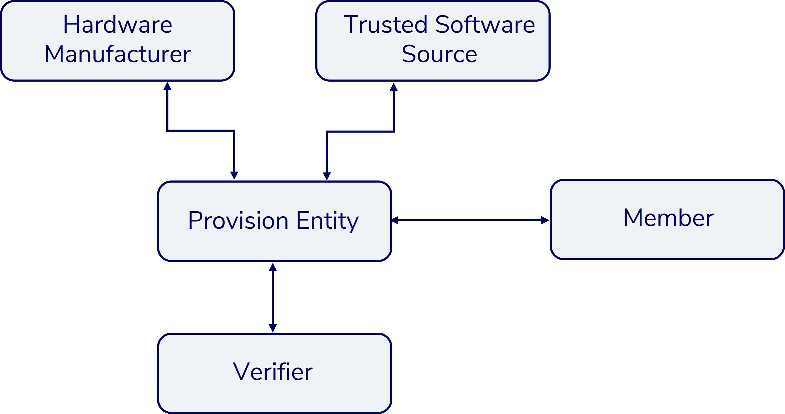

# 4.8.2 Concept

The goal of remote attestation is to enable the verifier to trust a member. The verifier wants to trust the hardware and software, which is physically at the member's site. The assumption is that the verifier has never accessed the hardware of the member. Therefore, other parties offer a root of trust, which is implanted in the hardware. In the picture below are three other parties, where most important one is the provision entity. She is a distributor of hardware and has also the ability to program the devices. So, they take hardware from the official manufacturers and combine it with software from a source, which is trusted by the verifier. Afterwards, this bundle is purchasable by everyone, who wants to participate. In conclusion, if somebody wants to become a member of the service, he has to buy a device from provision entity. These devices are ready to perform remote attestation.

The verifier is concerned about integrity and confidentiality and requires a proof that:

1. Member’s hardware is genuine, attested by the provision entity in a manner that the verifier is able to identify devices in the field by secure cryptographic methods
2. Member’s hardware runs exactly the code as published open source by the Trusted Software Source
3. Data supplied to the TEE is treated confidentially

To fulfill these requirements each role is specified in the following sections.
