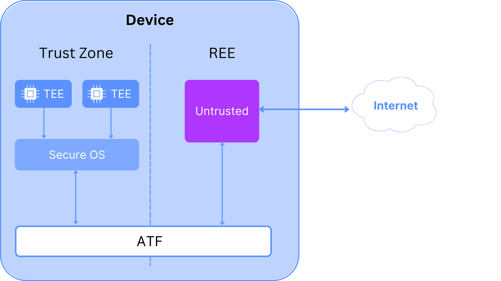

# 4.8.3.4 Member

The member buys a device from the provision entity. This device can only boot from signed images, which are signed by the trusted software source. These images then perform a secure boot. This image sets up a system, that is split in two halves. In one half starts a rich OS, which is considered untrusted. In the other half starts a secure OS. This half is protected from the other side with ARM Trust Zone. The secure OS such as OPTEE, is able to host different TEEs in parallel and ensures encapsulation of these TEEs.

<figure><figcaption></figcaption></figure>

