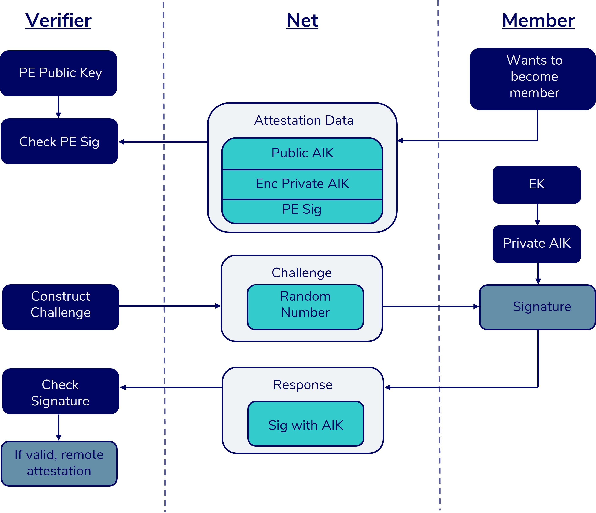

# 4.8.3.5  Verifier

To do an actual remote attestation, the verifier needs at first the public key from the provision entity. Then the verifier waits on request from the member. When he wants to join, he send his request, the attestation data. The verifier then validates the attestation data. If the data is valid, he knows the public AKI. To validate the public AIK, he generates a challenge. The simplest challenge is a random number. This number is sent to the member. The member decrypts the private AIK and signs the random number with it. Afterwards he sends the signature back with some system measurements. The verifier can validate the signature. If the signature is valid, the verifier can make the following assumptions:

1. The private AIK used to forge the signature belongs to the public AIK from the attestation data, therefore there a valid key pair
2. The AIK was generated by the provision entity, because it is signed with the PE-Key
3. The device is a provisioned hardware, because the hardware is the only one which knows the EK and is able to decrypt the private AIK.
4. The hardware has booted a trustful system, because the eFuses were burnt by the provision entity

