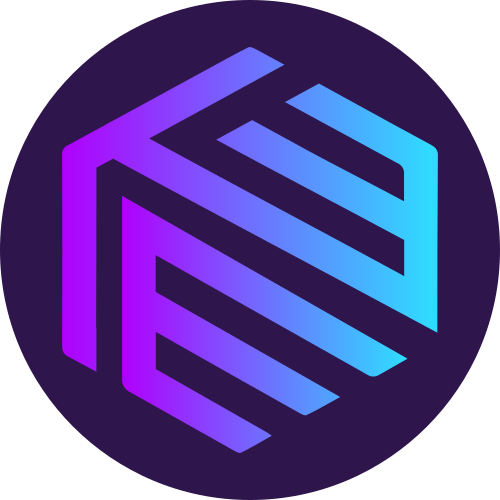

# 6.2 Visual Materials

## **Logo Assets**

\
We provide developers and other professionals with visual materials such as videos, logos, fonts, and more. You can access them in our Media Kit [here](https://drive.google.com/drive/u/2/folders/1--3HV8NkIOQqS70r7fhLHU8yl4CcRLI6).

Integritee welcomes partnerships of different sorts. If you have an idea you believe is worth sharing with us, contact our team by sending an email to [hello@integritee.network](mailto:hello@integritee.network).

### Logos

L1.  Primary Logo

<figure><figcaption></figcaption></figure>

L2. Secondary Logo

<figure><figcaption></figcaption></figure>

L3. Token Icons&#x20;

<figure><figcaption></figcaption></figure>

## Choice of Color

* On a white background, the "blue text" logo is preferred.

<figure><figcaption></figcaption></figure>

* On a dark background, the "white text" logo is preferred. This logo can be found in our Media Kit linked above, with a transparent background.

<figure><figcaption></figcaption></figure>

Token Asset

TEER 

## Color scheme

### Palette of Integritee colors

<figure><figcaption></figcaption></figure>

